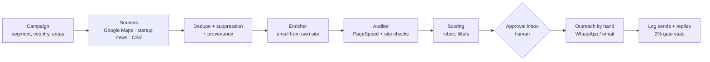

# Shwez Lead Engine

An internal tool for Shwez Studio that finds businesses with a missing, broken or weak website, audits the site, scores the lead, and helps the team reach out and track replies until a discovery call is booked.

- **Product spec (source of truth for scope):** [`docs/Shwez Lead Engine — Product Spec.md`](docs/Shwez%20Lead%20Engine%20%E2%80%94%20Product%20Spec.md)
- **Development plan and progress checklists:** [`docs/plans/`](docs/plans/README.md)
- **Rules for AI-assisted development:** [`CLAUDE.md`](CLAUDE.md)

## Status (27 Sep 2026)

The project is in **Phase 0: validate the offer**. The spec's rule is to build the expensive parts (AI drafting, email verification, automated sending) only after 50 hand-sent messages reach a **≥ 2% positive reply rate**.

| Works today | Waits for the Phase 0 result |
| --- | --- |
| Find leads: Google Maps campaigns, startup-funding news, CSV import | AI-written messages and fact checks |
| Find a published email on the business's own site | Email verification (Hunter, Reacher) |
| Audit the website (PageSpeed, HTTPS, mobile, contact form, CMS, broken/parked) | Automated Gmail sending, caps, send windows |
| Score with the spec's rubric; archive too-small and chain-branch leads | Automatic follow-ups and reply classification |
| Approval inbox: approve/reject, WhatsApp drafts, log sends and replies, 2% gate stats | Telegram alerts, weekly digest, pipeline board |
| Reddit inbox for "need a website" posts (needs Reddit API credentials) | Deployment to the Contabo server |

Progress lives in the checklists: [Phase 0](docs/plans/phase-0-validate.md) · [Phase 1a](docs/plans/phase-1a-foundation.md) · [Phase 1b](docs/plans/phase-1b-mvp.md) · [Phase 2](docs/plans/phase-2-close-loop.md) · [Phase 3](docs/plans/phase-3-expand.md). Decisions and open questions are in [`docs/plans/README.md`](docs/plans/README.md).

## How it works



Every lead is a row in `le_leads` whose **state** drives the pipeline:
`discovered → enriched → audited → scored → awaiting_approval | archived → approved → in_sequence → replied → handed_to_admin | closed_lost | suppressed`, or `closed_no_response`.
Each state change goes through one function (`transition()`) that also writes an event row, so every lead has a full timeline.

**Guardrails built in:**
- Every audit claim maps to a measured value.
- A site is called "broken" only if Google's Lighthouse can't load it either. Sites that block bots are never called broken.
- Chain branches (the website is a branch page on a chain's site) and businesses with fewer than 10 Google reviews are archived automatically. The review cutoff can be changed in Directus.
- Opt-outs are stored as hashes on a permanent suppression list that every import and scan checks.
- Nothing is sent automatically. WhatsApp and email are sent by a person.

## Tech stack

| Layer | Choice |
| --- | --- |
| Admin app | Nuxt 4, Nuxt UI v4 (from the `nuxt-ui-templates/dashboard` template), `nuxt-auth-utils` sessions |
| Backend data, auth, roles | **Shared** Directus 11 at `https://cms.shwezstudio.in` (Postgres) |
| Worker | Node 22 + TypeScript, run with `tsx`; polls Directus every 30 s (pg-boss planned) |
| External APIs | Google Places API (New), PageSpeed Insights, Google Maps JavaScript API (map picker), Reddit API |
| Other data | `@countrystatecity/countries` (area suggestions), Inc42 + YourStory RSS |
| Tests | `node:test` via `tsx` |

## Repository layout

```
apps/admin/          Nuxt admin app (screens + server routes that call Directus as the signed-in user)
apps/worker/         Worker: src/index.ts (loop), src/pipeline.ts, src/agents/ (scanners, enricher, auditor, analyser), src/cli/
packages/shared/     Shared TS: state machine, rubric, decisions, phone rules, WhatsApp drafts, Places + Directus clients
infra/directus/      setup.ts (create-only schema/roles/seed) and cleanup-test.ts
docs/                Product spec and docs/plans/ checklists
```

## Getting started

**You'll need:** Node 22 (`.nvmrc`), pnpm 11, and access to cms.shwezstudio.in.

```bash
pnpm i
cp .env.example .env                 # then fill it in (see below)
ln -s ../../.env apps/admin/.env     # the admin app reads the root .env through this link (not stored in git)
pnpm dev                             # admin on http://localhost:3000 + worker (restarts on file changes)
```

Sign in with a cms.shwezstudio.in account. Only Directus admins and users with an `LE …` role can sign in.

### Environment variables

| Variable | Needed for | Where to get it |
| --- | --- | --- |
| `DIRECTUS_URL` | everything | `https://cms.shwezstudio.in` |
| `DIRECTUS_TOKEN` | worker, CLI | Static token of the **LE Worker** user in Directus (can only touch `le_*`) |
| `DIRECTUS_SETUP_TOKEN` | `le:setup`, `le:cleanup-test` | A Directus admin token. Keep it local, rotate it if it's ever shared |
| `NUXT_SESSION_PASSWORD` | admin login | 32+ random characters: `openssl rand -base64 32` |
| `PAGESPEED_API_KEY` | audits | Google Cloud → enable *PageSpeed Insights API* → API key (Application data). Without it Google allows no checks |
| `GOOGLE_PLACES_API_KEY` | Maps scans, preview, news matching | Google Cloud → enable *Places API (New)* (billing required). Can be the same key as PageSpeed if both APIs are allowed on it. Set a budget alert |
| `NUXT_PUBLIC_GOOGLE_MAPS_KEY` | "Pick on map" | Separate key for *Maps JavaScript API*, restricted by HTTP referrer (`http://localhost:3000/*`, production domain). It is visible in the browser |
| `REDDIT_CLIENT_ID`, `REDDIT_CLIENT_SECRET`, `REDDIT_USERNAME` | Reddit inbox | reddit.com/prefs/apps → create app, type *script*. Read Reddit's Data API terms first (commercial use is restricted) |
| `NUXT_DIRECTUS_URL` | admin (optional) | Overrides the Directus URL for the admin app |
| `SEND_MODE`, `SEND_ALLOWLIST`, `ANTHROPIC_API_KEY`, `HUNTER_API_KEY`, `REACHER_URL`, `GMAIL_OAUTH_*`, `RESEND_API_KEY`, `TELEGRAM_BOT_TOKEN`, `SENTRY_DSN`, `QUEUE_DATABASE_URL` | later phases | Not used yet |

`.env` is git-ignored. Never commit it, and add new variables to `.env.example` by name only.

## Commands

| Command | What it does |
| --- | --- |
| `pnpm dev` | Admin app + worker in watch mode |
| `pnpm --filter @lead/admin dev` | Admin app only (http://localhost:3000) |
| `pnpm le:worker` | Worker only, no reload: Maps/news scans, enrich → audit → score every 30 s, Reddit every 15 min. **Restart after code changes** |
| `pnpm le:import <file.csv> --country GB --campaign "<name>" [--segment "<segment>"] [--source mantis] [--test]` | Import leads from a CSV (tolerant headers: name, website, phone, email, city, reviews, maps URL …) |
| `pnpm le:process --campaign "<name>"` | One-off enrich + audit + score for a campaign. Don't run it alongside the worker |
| `pnpm le:setup [--apply] [--verbose]` | Create or extend the `le_*` Directus schema, roles and defaults. Dry run unless `--apply` |
| `pnpm le:cleanup-test [--apply]` | Delete all test-campaign data. Dry run unless `--apply` |
| `pnpm test` / `pnpm typecheck` / `pnpm lint` | Tests (38), type checks, lint |
| `pnpm --filter @lead/worker exec tsx --test src/<path>.test.ts` | One test file |

## Using the admin app

| Screen | What it's for |
| --- | --- |
| **Approval inbox** `/` | Per campaign. Tabs: Awaiting approval (approve with offer / reject with reason), To send (WhatsApp button, mark as sent), Sent (follow-ups, log reply, close), Outcomes, Archived. The stats bar shows sent / reply / positive / bounce % and the 2% gate |
| **Campaigns** `/campaigns` | Create a campaign: source (Google Maps or Startup news), segment, country, search query, areas (region → city suggestions, free text, or a rectangle picked on the map). Preview spends 1 Google search on the first area. Then Launch, Pause/Resume, and see per-stage counts |
| **Segments** `/segments` | Business types a campaign targets, with the service and case studies used in each lead's plan |
| **Reddit** `/reddit` | Posts matching the watch list; reply in the thread yourself, then mark replied or dismiss |
| **Team & settings** | Opens Directus: users and roles, `Le Global Config` (min reviews, caps, cadence, default owner, LLM budget) |

Typical flow: create a campaign → Preview → Launch (worker running) → approve leads → send by hand (WhatsApp/email) → **Mark as sent** → **Log reply** when they answer.

## The shared Directus: read before changing anything

cms.shwezstudio.in also holds **other projects' data**. The lead engine is isolated by convention and by code:

- Every collection is prefixed `le_` and lives in the **Lead Engine** folder. Roles are `LE Admin`, `LE Campaign manager`, `LE Closer` and `LE Worker`, and none of them can see non-`le_` collections.
- Schema changes go **only** through `infra/directus/setup.ts`. It is create-only, dry-run first, and a tested guard refuses any write outside `le_*` / `LE *`.
- **Never run `directus schema apply`** against this instance: it diffs the whole instance and can delete other projects' collections.
- Develop inside campaigns marked **Test**; `pnpm le:cleanup-test` removes them. The suppression list and LLM usage are never deleted.

Main collections: `le_campaigns`, `le_segments`, `le_businesses`, `le_signals` (provenance), `le_contacts`, `le_audits`, `le_leads`, `le_events` (timeline), `le_messages`, `le_replies`, `le_suppression`, `le_posts` (Reddit), `le_global_config`.

## Compliance notes

- **Provenance:** every contact stores the page and date it was found on (DPDP / UK GDPR).
- **Opt-out:** every message names the sender and offers an opt-out ("Reply STOP"). Opt-outs are hashed onto a permanent suppression list.
- **Platform terms:** only official APIs are used (Google Places, not Maps scraping). There are no automated DMs, and Reddit is answered by hand in the thread.
- **Scope and legal review:** Harshad chose global leads with no country restrictions and no legal review (27 Sep 2026; see [`docs/plans/README.md`](docs/plans/README.md)). Canada (CASL) and parts of the EU have stricter consent rules for cold email.

## Deployment

Not deployed yet; the plan is after more testing. The target is the existing Contabo VPS alongside the shared Directus: admin app on a subdomain, worker running all the time, backups. See [Phase 1b → Prep](docs/plans/phase-1b-mvp.md). Until then the worker only runs while `pnpm le:worker` (or `pnpm dev`) is open on a machine.

## Licences and attributions

- Area suggestions use the [countries-states-cities database](https://github.com/dr5hn/countries-states-cities-database) via `@countrystatecity/countries`, licensed **ODbL-1.0**. Keep this attribution if the tool is ever distributed or productized.
- The admin app started from the MIT-licensed [Nuxt UI dashboard template](https://github.com/nuxt-ui-templates/dashboard) (see `apps/admin/LICENSE`).
- Startup news comes from the public Inc42 and YourStory RSS feeds; only headlines and links are stored.

Private repository, internal to Shwez Studio.
