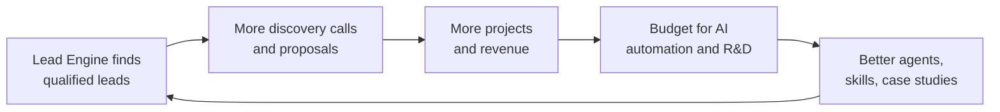
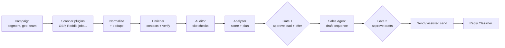
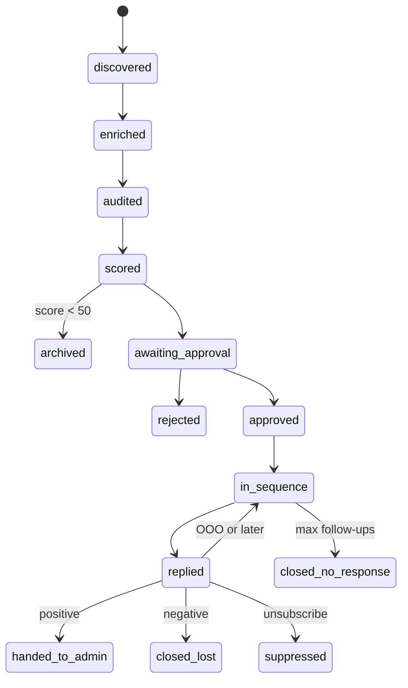
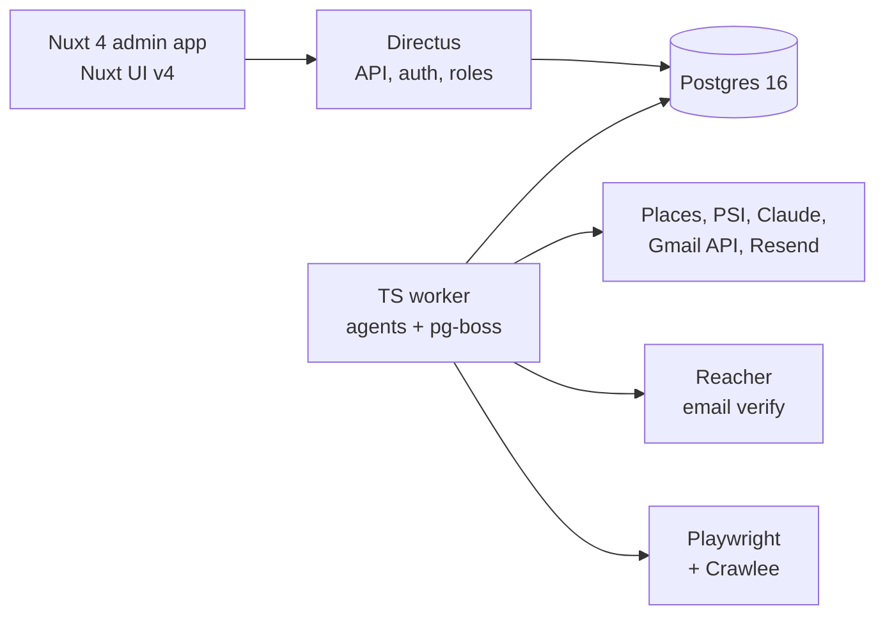

# Shwez Lead Engine — Product Spec

Sep 25, 2026 · @Harshad Satra

## Summary

**Status: final spec, 26 Sep 2026.** Shwez Lead Engine is an internal system of AI agents that finds local businesses with a missing or broken website, audits their site, and runs approved email outreach through to a booked call, so Shwez Studio gets more projects and more budget for AI automation.

- **Edge:** similar tools either find leads (Mantis AI, LeadSweep) or run cold email (Instantly, Smartlead). None closes the full loop of discovery, audit, approval, sequence, reply handling and handoff across parallel team campaigns at India pricing. That loop is what we build.
- **How it runs:** campaigns set segment, area, budget (₹30,000 default minimum) and team; Harshad is the default owner. Every lead and first message is approved by a human before sending.
- **Stack:** Nuxt 4 + Nuxt UI v4, Directus on Postgres, one TypeScript worker with pg-boss and Claude via the Vercel AI SDK, Gmail API for cold email, Resend for system mail, one VPS.
- **Cost:** about 71 dev-days to build (\~₹5 lakh with AI-assisted coding) and ₹8,000–28,000 a month to run; one ₹1 lakh project covers about 3 months of running cost.
- **First step:** Phase 0 tests the offer on 50 leads from Mantis AI or LeadSweep with hand-run audits; building phase 1 starts only if positive replies reach 2%.

## Overview and growth flywheel

Shwez Lead Engine is an internal system of AI agents that finds businesses with a visible web need, proves it with a site audit, and runs the outreach. Its only job is to grow Shwez Studio: more qualified leads become more projects, more projects fund more AI automation, and each cycle makes the engine and the team better.



Every win also feeds the engine back: won and lost outcomes tune the scoring, new case studies sharpen the pitch, and new skills open new segments.

**Problem.** Shwez Studio's pipeline depends on referrals, repeat clients and directory listings. Finding and qualifying new clients by hand takes hours a week and doesn't scale. Off-the-shelf AI SDR tools cost $250–2,500 a month, write generic copy, and aren't built for an agency selling websites to Indian SMBs.

**Edge.** Shwez is a dev studio, so the engine can open with proof: a real audit of the prospect's site (speed, mobile, broken flows, outdated stack). Generic AI SDRs can't do that. A few lead tools (LeadSweep, Mantis AI) flag website gaps or audit sites, but none runs the full loop through follow-ups, replies and handoff.

## Goals, non-goals and success metrics

The v1 target is 4 qualified discovery calls a month by month 3, at under 3 hours of admin time a week.

**Goals**

1. Generate a steady flow of qualified leads without manual prospecting.
2. Convert leads to discovery calls through audit-led, personalized outreach.
3. Keep the admin (Harshad) in control through approval gates and a simple UI.
4. Stay compliant with DPDP and platform terms, and protect the shwezstudio.in domain.
5. Learn from every outcome so scoring and messaging improve each month.

**Non-goals for v1**

- No automated DMs on LinkedIn, Instagram or X. Account bans and legal risk outweigh the gain; these stay draft-and-send-manually.
- No bought contact lists or mass blasting. Volume without fit burns domains.
- No self-built mail servers or warmup network. Send through Resend and the Workspace mailbox.
- No multi-tenant SaaS. Build for Shwez first; productizing (e.g. inside Propflow) comes after it proves itself.
- No AI voice calling. Premature for this market and budget.

**Success metrics**

| Metric | Type | Success (month 3) | Stretch |
| --- | --- | --- | --- |
| Qualified leads approved per week | Leading | 25 | 50 |
| Email deliverability (inbox, not bounce) | Leading | ≥ 97% delivered, < 2% bounce | < 1% bounce |
| Reply rate (any reply) | Leading | 5% | 10% |
| Positive reply rate | Leading | 2% | 4% |
| Discovery calls booked per month | Lagging | 4 | 8 |
| Projects won per quarter | Lagging | 2 | 4 |
| Cost per qualified lead (tools + LLM) | Efficiency | < ₹150 | < ₹75 |
| Admin time per week | Efficiency | < 3 hours | < 1.5 hours |

Review metrics weekly for the first two months, then monthly. Kill-or-pivot check at week 8: if positive reply rate is under 1%, rework the offer or segment before adding scanners.

## ICP and scoring

These segments form the segment library that campaigns pick from; a campaign can also define a custom segment. Defaults target established Indian SMBs whose website is missing, broken or clearly holding them back, in sectors where Shwez already has case studies.

**Target segments (ordered by launch priority)**

| Segment | Signal the engine looks for | Likely service | Proof from past work |
| --- | --- | --- | --- |
| Real estate developers and brokers | Project launch, slow or non-mobile site, no lead forms | Website + CRM integration | Real estate portfolio, Kishco CRM |
| Restaurants, cafés, hotels | Strong GBP reviews but no site or a broken booking flow | Website, booking, Shopify menu/merch | Hospitality projects |
| Clinics and health tech | Poor mobile site, no appointment booking | Website + booking + WhatsApp integration | Health tech projects |
| D2C and e-commerce brands | Instagram-only store, slow Shopify/WooCommerce | Shopify build or rebuild | E-commerce, Shopify work |
| Startups (seed to Series A) | Funding news, hiring web devs, outdated landing page | SaaS/full-stack, landing pages | SaaS, DocuX |
| Edtech and coaching institutes | Old WordPress, no online enrolment | Web app, LMS, payments | Edtech projects |

**Disqualify automatically:** individuals and sole hobby accounts, businesses with no public&#32;

|  |  |  |
| --- | --- | --- |
|  |  |  |
|  |  |  |

business contact, competitors (agencies, freelancers), sites rebuilt in the last 6 months with good audit scores, and anyone on the suppression list.

**Scoring rubric (0–100).** The Analyser applies these weights; the LLM extracts facts and explains, but the score comes from the rubric so it stays consistent and tunable.

| Factor | Weight | High score when |
| --- | --- | --- |
| Need (audit severity) | 30 | No site, or PageSpeed mobile < 40, broken forms, no SSL, outdated CMS |
| Intent signal | 20 | Explicit ask ("looking for a developer"), funding, hiring, new location |
| Business size and budget fit | 20 | 50+ Google reviews, multiple locations, active ads, team of 10+ |
| Segment fit | 15 | Matches a segment above with a relevant case study |
| Reachability | 10 | Verified business email or WhatsApp Business number found |
| Recency | 5 | Signal is under 14 days old |

Bands: 70+ goes to the approval queue as hot, 50–69 as warm, under 50 is archived with its reason (kept for tuning, auto-deleted after 90 days).

## Campaigns, teams and global configuration

Every automation run starts from a Campaign: an input that sets who to target, where, at what budget, and which team owns the replies. Campaigns run in parallel, so different teams can work their own launches at the same time.

**Campaign inputs**

| Field | Example | Default |
| --- | --- | --- |
| Name | Mumbai real estate, Q4 | Required |
| Segment | Real estate developers and brokers, or a custom segment | Required |
| Geography | Map picker (pan or draw areas), or a city list | Required |
| Minimum project budget | ₹50,000 | Global default |
| Scanners | GBP, manual import | GBP |
| Scoring weights | Inherit from segment, override per campaign | Segment weights |
| Weekly lead cap | 25 | Global default |
| Channels | Email; assisted LinkedIn | Email |
| Team and owner | A team from Team management | Harshad |
| Follow-up cadence | Day 0, 3, 7, 14 | Global default |
| Offer mode | Ask owner per lead | Ask per lead |
| Sending mailboxes | Mailboxes from the pool | Shared pool |

**Launch confirmation.** Before a campaign starts, the engine runs a small sample scan and shows a pre-flight summary: estimated leads in the area, mailbox capacity per day, and estimated monthly cost. The owner confirms before anything scans at scale or sends.

**Running in parallel**

- A business already active in one campaign is skipped by the others (dedupe across campaigns).
- The suppression list is global.
- Mailbox daily caps are shared across every campaign using that mailbox.
- Each campaign has its own pipeline view and metrics; campaigns can be paused, resumed or cloned. A campaign can also be saved as a monitored territory, so only newly opened businesses in its area enter the pipeline.

**Team management**

| Role | Can do |
| --- | --- |
| Admin | Everything, including global config and mailboxes |
| Campaign manager | Create and run campaigns, approve leads and drafts, choose the offer per lead |
| Closer | Receives hot replies, replies to leads, runs discovery calls |

Harshad is the default owner and closer on every campaign until someone else is assigned. Hot-reply alerts go to the campaign's closer; if unanswered within 4 business hours, they escalate to Harshad.

**Global configuration:** default minimum project budget (₹30,000 to start, with per-segment overrides), default weekly lead cap, follow-up cadence and maximum follow-ups, send windows and holidays, monthly LLM budget, default offer mode, and default owner (Harshad).

**Offer per lead.** At Gate 1 the campaign manager picks the offer for each lead: full audit PDF, free homepage mockup (hot leads only, since a mockup costs hours), or just a call ask. The Sales Agent drafts to match, and the choice is logged so each segment learns which offer converts.

## System architecture

The engine is a pipeline of six agents coordinated by a job queue and a single lead record whose state drives every step. Most agents are deterministic jobs with one LLM step; only the Analyser, Sales Agent and Reply Classifier lean heavily on the model.



Gate 2 is on for every lead in phase 1. From phase 2, drafts for leads scoring 80+ in a proven segment can auto-send once the admin enables it per segment.

**Lead state machine**



Every transition writes an event row (who or which agent, when, why), so each lead has a full timeline and the closing summary can be generated from it.

**Design principles**

- Human in the loop by default; autonomy is earned per segment with data.
- One source of truth: the lead record in Postgres. Agents never message each other directly; they read state, do work, write state.
- Idempotent jobs: any job can be retried without double-sending.
- Hard limits live in code (send caps, follow-up count, cost per lead), not in prompts.

## Agent specs

Each agent has one input state, one output state, and acceptance criteria that can be tested without the others.

### 1. Scanner (plugin per source)

Finds raw signals and turns them into lead candidates. New platforms are added as plugins without touching the rest of the pipeline.

```typescript
interface ScannerPlugin {
  id: string;                      // "gbp", "reddit", "jobs", "x"
  schedule: string;                // cron, e.g. "0 6 * * *"
  mode: "automated" | "assisted";  // assisted = human pastes/imports
  fetch(ctx: ScanContext): Promise<RawSignal[]>;
  normalize(raw: RawSignal): LeadCandidate; // includes source URL + timestamp
}
```

| Plugin | Phase | Method | Signal |
| --- | --- | --- | --- |
| Google Business Profiles | 1 | Google Places API, by segment + locality grid; each grid cell cached and re-scanned only after 30 days | No/poor website, review count, category |
| Manual import | 1 | CSV / paste URL in UI, including Mantis AI exports | Anything the admin spots |
| Reddit | 2 | Official Reddit API, keyword + subreddit watch | "Need a developer", "website recommendations" |
| Job boards | 2 | Public job listings (RSS/APIs where allowed) | Hiring web dev / Shopify dev |
| Startup news | 2 | Funding news feeds (Inc42, YourStory RSS) | Recent funding round |
| X (Twitter) | 3 | Official X API keyword search | Explicit asks for devs |
| LinkedIn | 3 | Assisted only: admin saves posts/profiles via bookmarklet | Posts asking for agencies |
| Instagram | 3 | Assisted only | D2C brands selling via DMs |

Two more plugins are planned. **Territory monitor** (phase 2): re-scans a saved campaign area weekly and passes on only newly opened businesses. **Audit widget** (phase 3, inbound): a free site-audit form on shwezstudio.in that runs the Auditor and creates a lead from the person who asked.

Acceptance: duplicates across sources merge into one lead (match on domain, phone, then fuzzy name + locality); each candidate stores its source URL and scan time.

### 2. Enricher

Finds and verifies a business contact. Waterfall: website contact page and footer, then GBP phone, then Hunter.io domain search, then pattern guess, then verification (MX + SMTP check via a verifier API). Only role or published business contacts are stored.

Acceptance: no email is marked usable unless verification returns "valid"; each contact records how it was found.

### 3. Auditor

Runs objective checks on the lead's website and produces a short, factual audit.

- PageSpeed Insights API (mobile + desktop scores, LCP, CLS)
- SSL, mobile viewport, broken links on the homepage, contact form presence and submit test (no real submission); parked domains, soft 404s, "under construction" pages and Facebook-only listings count as no working website
- Stack detection (CMS, Shopify/WooCommerce, jQuery/WordPress version age)
- Screenshot (mobile + desktop) for the admin and for outreach attachments

Output: 3 headline issues ranked by business impact, in plain language, plus the raw metrics. Acceptance: every claim in the audit maps to a measured value.

### 4. Analyser

Scores the lead with the rubric and writes the plan of action.

Output (structured JSON): score and per-factor breakdown, band, recommended service, suggested hook (the one issue to open with), best channel, relevant case study, and risks (e.g. "recently redesigned"). Acceptance: the score is reproducible from the stored facts; the plan cites at least one audit finding or intent signal.

### 5. Sales Agent

Drafts the sequence for the approved channel: first touch + up to 3 follow-ups over about 14 days (default day 0, 3, 7, 14).

- First touch: under 120 words, opens with the audit finding, one clear ask (15-minute call or "want the full audit?"), no attachments on the first email.
- Follow-ups add new value each time: the full audit PDF, a relevant case study, a hosted homepage mockup link (tracked, so the closer is alerted when it is viewed). Never "just bumping this".
- Final touch is a polite close ("closing the loop").
- Tone set in a style guide; banned phrases list ("I hope this finds you well", "synergy", etc.).

Acceptance: no draft states a fact not present in the lead record; every email carries the sender's real identity, address and an opt-out line.

### 6. Reply Classifier

Reads inbound replies (email webhook or IMAP poll) and classifies them.

| Class | Action |
| --- | --- |
| Interested / asks a question | Stop sequence, notify the campaign's closer instantly (email + Telegram/WhatsApp), draft a suggested reply |
| Not now / later | Stop, set a reminder for the date mentioned (default 90 days) |
| Referral to someone else | Stop, create a new lead for the referred contact, awaiting approval |
| Out of office | Pause, resume after return date |
| Not interested | Close as lost with summary |
| Unsubscribe / angry | Suppress permanently, close |
| Bounce | Mark contact invalid, try next contact or close |

Acceptance: any reply with confidence under 0.8 goes to the admin instead of being auto-actioned.

**Closing summary.** When a lead closes for any reason, an LLM writes a 3–5 line summary from the event timeline: what was found, what was sent, what happened, and a revisit date if relevant.

## Channels, compliance and deliverability

Only email (and later WhatsApp Business API) is sent automatically; social platforms are read-only or assisted, because LinkedIn has sued scrapers (Proxycurl shut down in July 2025) and has banned AI SDR vendors' accounts.

**Channel rules**

| Channel | Discovery | Outreach | Phase |
| --- | --- | --- | --- |
| Email | Enricher | Automated, after approval | 1 |
| WhatsApp Business | GBP phone | Template messages via official API, opt-in rules apply | 3 |
| LinkedIn | Assisted only | Draft in UI, admin sends manually (copy + deep link) | 3 |
| Instagram | Assisted only | Draft in UI, admin sends manually | 3 |
| X | Official API | Draft reply, admin posts manually | 3 |
| Reddit | Official API | Admin replies in thread as themselves; no DMs | 2 |

**Deliverability**

- Cold email goes from one dedicated Google Workspace mailbox on an already-warmed domain (decided 25 Sep 2026). If volume outgrows one mailbox, add mailboxes on a secondary domain rather than raising the cap.
- SPF, DKIM and DMARC verified before the first send. No warmup tool, since the domain is already warmed; cold volume still ramps: 15 new emails a day in week 1, 25 in week 2, 40 from week 3.
- Hard cap of 40 new cold emails per mailbox per day, enforced in code across all campaigns.
- Plain text, no tracking pixels in the first email, one link at most.
- Auto-pause the mailbox if bounce rate exceeds 3% or any spam complaint arrives; if the domain also carries client mail, a reputation hit affects that mail too.
- Send windows: Tue–Thu, 9:30–11:30 and 15:00–17:00 in the lead's time zone; no sends on public holidays.

**Sending split (decided: Resend).** Resend's acceptable use policy prohibits cold outreach and scraped contacts, and can shut an account down without warning. So the engine uses Resend for everything that isn't a first cold touch, and real mailboxes for cold email:

| Mail type | Sent via |
| --- | --- |
| First touch and follow-ups to leads who haven't replied | The dedicated Google Workspace mailbox, via Gmail API, scheduled by our job queue |
| Replies in an active conversation, audit PDFs a lead asked for | Same mailbox as the thread, so it stays one conversation |
| Admin alerts, weekly digest, team invites, password resets | Resend, from shwezstudio.in |
| Newsletters or updates to opted-in contacts (later) | Resend marketing |

This keeps Resend's account safe for system mail, and 1:1 mailbox sending also lands better than bulk-API mail for cold outreach.

**Compliance (DPDP Act 2023 + Rules 2025, full compliance due 13 May 2027)**

- Collect only business contact details the business itself published; store the source URL and date for every contact.
- Every message states who is writing, why they were contacted, and offers a one-click opt-out.
- Opt-outs and erasure requests are honoured immediately and added to a permanent hashed suppression list.
- Retention: closed leads' personal data auto-deleted after 12 months; archived (unapproved) candidates after 90 days.
- A short privacy notice page on shwezstudio.in covering outreach data, linked from every email.
- If EU or US leads are targeted later: add GDPR legitimate-interest assessment and CAN-SPAM address footer.

**No lawyer review for v1 (decided 25 Sep 2026).** A self-review checklist runs before every campaign launch instead: provenance is stored, opt-out works end to end, the privacy notice is live, and the suppression list is checked. Revisit legal review when sends pass about 1,000 a month, before targeting EU or US leads, before productizing, or on the first formal complaint.

## Data model

Nine Postgres tables cover v1; the lead row holds current state and everything else hangs off it.

| Table | Key fields | Notes |
| --- | --- | --- |
| `businesses` | id, name, domain, phone, locality, city, category, gbp\_place\_id, review\_count | Deduped entity; one per real business |
| `signals` | id, business\_id, source (plugin id), source\_url, signal\_type, raw (jsonb), found\_at | Many per business; provenance for DPDP |
| `contacts` | id, business\_id, name, role, email, phone, found\_via, verified\_status, verified\_at | Business contacts only |
| `audits` | id, business\_id, psi\_mobile, psi\_desktop, lcp\_ms, has\_ssl, cms, issues (jsonb), screenshots, run\_at | Re-run if older than 30 days |
| `leads` | id, business\_id, primary\_contact\_id, state, score, score\_breakdown (jsonb), band, segment, plan (jsonb), channel, approved\_by, approved\_at, closed\_reason, summary | The state machine lives here |
| `messages` | id, lead\_id, step (0–3), channel, subject, body, status (draft/approved/scheduled/sent/failed), sent\_at, provider\_msg\_id, inbox\_id | Every draft and send |
| `replies` | id, lead\_id, message\_id, body, classification, confidence, received\_at, actioned | Inbound |
| `events` | id, lead\_id, actor (agent or admin), type, payload (jsonb), created\_at | Full timeline; source for summaries |
| `suppression` | email\_hash, phone\_hash, domain, reason, created\_at | Checked before every send and every enrich |

Campaign and team tables: `campaigns` (name, segment, geography, min\_budget, scanners, weights override, weekly cap, channels, cadence, offer mode, status, owner\_id), `campaign_mailboxes`, `team_members` (name, email, role), and `campaign_members` (campaign, member, role). `leads` gains `campaign_id`, `owner_id` and `offer` (audit\_pdf / mockup / call\_only).

Supporting config tables: `global_config` (default budget, caps, cadence, send windows, LLM budget, default owner), `segments` (ICP, weights, budget override, auto-send flag), `mailboxes` (domain, provider, daily cap, health), `templates` (style guide, banned phrases), and `llm_usage` (tokens and cost per lead per agent), `preview_sites` (lead, mockup URL, view count, last viewed) and `territories` (campaign, area, re-scan schedule, last scan).

## Admin UI and approval gates

Six screens, designed for a 15-minute daily review on desktop or phone. Every screen filters by campaign.

1. **Campaigns.** List of campaigns with status, owner and headline metrics; New campaign opens the input form, then the pre-flight summary and confirm step.
   1. Actions: Launch, Pause, Resume, Clone, Archive.
2. **Approval inbox (home).** One card per lead awaiting a decision: campaign, business name, score and band, the top audit finding with a screenshot, the recommended hook, and the draft first message.
   1. Offer picker: full audit PDF, free homepage mockup (hot leads only), or call ask only; the draft updates to match.
   2. Actions: Approve and send, Edit draft, Reject (with a one-tap reason that feeds scoring), Snooze.
   3. Keyboard shortcuts (A / E / R) and swipe on mobile.
   4. Assisted-channel leads show Copy message + Open profile instead of Send.
3. **Pipeline board.** Kanban by state: Approved, In sequence, Replied, Handed to closer, Closed. Clicking a lead opens its timeline (signals, audit, messages, replies, events).
4. **Hot replies.** Positive replies for the signed-in closer at the top, with the suggested response; one click to reply from the same mailbox or send a booking link (Cal.com). Mockup views show here too, as a buying signal.
5. **Team.** Invite members, set roles (Admin, Campaign manager, Closer), assign them to campaigns. Harshad is the default owner.
6. **Settings (global configuration).** Default minimum budget and per-segment overrides, lead caps, follow-up cadence, send windows, mailboxes and caps, scanner schedules, style guide, suppression list, and monthly LLM budget.

A **weekly digest** (email or Telegram, Monday 9:00) reports leads found, approved, sent, replies, calls booked, cost, and the three best-performing hooks.

**Approval gates**

- Gate 1 (lead + offer): always on. Nothing is contacted until the campaign manager approves the lead and picks its offer.
- Gate 2 (message): on for all leads in phase 1. From phase 2, can be switched off per segment when its positive reply rate is 2%+ over 100 sends and zero complaints.
- Emergency stop: one toggle pauses all sending across all inboxes.

## Open-source starting points

No single repo is a ready-made base for this engine, but free building blocks cover about 20 of the 91 build days: Directus gives the backend, auth, roles and settings screens; the Nuxt UI dashboard template gives the admin shell; and mature libraries cover crawling, audits, tech detection and email verification.

**Use directly (build on these)**

| Repo / tool | Replaces | License | Est. days saved |
| --- | --- | --- | --- |
| [Directus](https://github.com/directus/directus) (self-hosted on Postgres) | Auth, roles (team management), settings and suppression screens, file storage, REST API, webhooks | BSL 1.1, free for teams under 50 people and $5M revenue via the [Open Innovation Grant](https://directus.com/resources/1000-license-keys-granted) (register for a key) | 8 |
| [Nuxt UI v4 dashboard template](https://nuxt.com/blog/nuxt-ui-v4) | Admin shell: sidebar, tables, forms, kanban-ready components | MIT, fully free since v4 merged Pro into the free library | 4 |
| [Crawlee](https://github.com/apify/crawlee) + Playwright | Enricher's website crawling (contact pages, footers), Auditor's screenshots and form checks | Apache-2.0 | 2 |
| [Unlighthouse](https://github.com/harlan-zw/unlighthouse) + PageSpeed Insights API | Multi-page Lighthouse audits beyond the homepage | MIT | 1 |
| [Wappalyzer fingerprints](https://github.com/catchpoint/WebPageTest.Wappalyzer) (WebPageTest's maintained fork) | Stack detection: CMS, Shopify/WooCommerce, library versions | GPL-3.0 (fine for internal use) | 1 |
| [Reacher check-if-email-exists](https://github.com/reacherhq/check-if-email-exists) (Docker HTTP backend) | Paid email verification (ZeroBounce/NeverBounce) | AGPL-3.0; commercial license needed if productized | 1 |
| Vercel AI SDK with Anthropic provider | Structured JSON outputs, retries, token tracking for every agent | Apache-2.0 | 2 |
| pg-boss | Job queue on the same Postgres (no Redis) | MIT | 1 |

**Read for patterns (don't fork)**

| Repo | Worth taking |
| --- | --- |
| [brightdata/ai-sdr-bdr-agent](https://github.com/brightdata/ai-sdr-bdr-agent) | Agent split (discovery, triggers, contact research, messaging, pipeline) and prompt structure |
| [thefalc/multi-agent-ai-sdr-flink-orchestrator](https://github.com/thefalc/multi-agent-ai-sdr-flink-orchestrator) | Event-driven handoffs and the score-then-route pattern |
| [iPythoning/b2b-sdr-agent-template](https://github.com/iPythoning/b2b-sdr-agent-template) | Per-lead conversation memory and human-like send delays |
| [directus-labs/agency-os](https://github.com/directus-labs/agency-os) | Nuxt + Directus patterns for an agency CRM; built on Nuxt 3 with open build issues, so reference only |

**Avoid:** Google Maps scrapers that bypass the Places API, and any LinkedIn profile-scraping API (the Proxycurl pattern). Both break platform terms and can disappear overnight.

**Caveats:** Reacher needs outbound port 25, which many clouds block by default, so pick a VPS that allows it and never run it on the sending mailbox's network. Directus changed its license terms recently, so confirm eligibility when registering the key.

## Market check: similar tools

### Mantis AI

[Mantis AI](https://mantisai.in/) is an Indian tool doing almost exactly our discovery step: it finds local businesses with no website or a weak presence and sells their contacts to agencies. It validates the thesis, gives us a cheap Phase 0 data source, and confirms that discovery alone is a commodity. Our edge stays the audit-led outreach, follow-ups and reply handling, which it does not do.

**What it offers:** website-gap detection, live search across maps, websites and social profiles, owner/decision-maker finder, a high-intent score combining the digital gap with review volume and rating, a shared lead pipeline, and CSV/Excel/CRM export.

**Pricing (credits, no subscription):** free tier of 100 credits (about 20 leads with contacts); ₹3,499 for 4,000 credits (about 800 leads, roughly ₹4.40 per lead); 5 credits per lead; re-searching an already-scanned area is free. API access is on the Enterprise plan.

**Ideas we're taking**

| Idea | Where it goes in this spec |
| --- | --- |
| Use Mantis for Phase 0 leads instead of pulling 50 by hand | Roadmap, phase 0 |
| Mantis CSV exports as a lead source (API later if we buy Enterprise) | Scanner: manual import plugin |
| Cache results per map area and re-scan only after a set time | Scanner: GBP plugin, cuts Places API cost |
| Map picker for campaign geography | Campaign inputs |
| Owner name on each lead for personalized openers | Enricher (from website About/team pages and GBP) |
| Credit pricing benchmark (₹0.75–1 per credit, \~₹4 per lead) | Phase 4 productization |

**Build vs. buy for discovery.** At about ₹4 per lead with contacts, Mantis is cheaper than our own GBP scanner plus Enricher for pure discovery. Keep building ours for control, audit data and dedupe, but if the phase 1 build slips, Mantis exports can feed the Auditor and Sales Agent directly.

**Treat with caution:** its testimonial names match the names in its own demo data, and big-agency logos and a 31% reply-rate claim are unverified. Test the free tier on one Mumbai locality and check contact accuracy before relying on it. Its LinkedIn and social enrichment may carry the same platform-terms risk noted in the compliance section.

### Wider landscape

The market splits into three groups, and none of them closes the whole loop from local discovery to audited pitch to follow-ups to reply handling. [LeadSweep](https://www.leadsweep.io/) comes closest, and it stops at a copy-and-send email draft.

| Tool | Group | What it does | Price | Gap vs. our engine |
| --- | --- | --- | --- | --- |
| [LeadSweep](https://www.leadsweep.io/) | Local lead finder | Grid-scans an area, checks every site with 16 health checks, AI score with pitch angle, email drafts, AI mockup preview sites with open alerts, territory monitoring | $39–99/month (credits) | No sending, follow-ups or reply handling; not India-focused |
| [Mantis AI](https://mantisai.in/) | Local lead finder | Website-gap leads, owner finder, pipeline, export | From ₹0; \~₹4 per lead | No audit, no outreach |
| [B2BLeadFinder](https://b2bleadfinder.io/tools/find-businesses-without-websites) | Local lead finder | Google Maps scan, no-website filter, audit button, decision-maker finder | 7-day trial | No automated sequences |
| [LeadWebia](https://leadwebia.com/blog/businesses-without-website-guide), [LocalLead](https://local-leadfinder.com/), [ScanForLeads](https://peerpush.com/p/scanforleads) | Local lead finders | No-website or website-check filters, CSV export | \~$1 per lead; mostly US-only | Lists only |
| [Outscraper](https://outscraper.com/local-businesses-without-websites/), [Apify actors](https://apify.com/santhej/nowebsite-lead-finder) | Raw data | Google Maps data with a "without website" filter and opportunity score | Pay per result | Scraping may breach Google terms; no pitch |
| [Insites](https://insites.com/seobest-seo-audit-for-agencies) | Audit-for-pitch | Branded audits: SEO, rankings, social, booking, competitor comparison | 15 free, then $49.50/month for 50 | No discovery or outreach |
| [MySiteAuditor](https://checkthat.ai/brands/mysiteauditor) | Audit-for-pitch | Embeddable audit widget that turns site visitors into leads, white-label PDFs | $49–79/month | Inbound only |
| [AuditPitch](https://auditpitch.com/tools/ai-cold-email-generator/) | Audit-for-pitch | Cold emails written from website audit findings, prospect pipeline | Not published | Unclear on sending and follow-ups |
| Instantly, Smartlead, Lemlist, Reply.io | Cold email platforms | Sequences, follow-ups, AI reply handling, deliverability | $39+/month | No local discovery or site audit |

**What this changes.** The audit-led pitch is no longer unique on its own; LeadSweep and AuditPitch both do it. Our edge is the closed loop run from our own mailbox: discovery, audit, approval, sequence, reply classification and handoff to a closer, across parallel team campaigns, at India pricing, with the data kept in-house.

**Ideas to add from these tools**

| Idea | Seen in | Where it goes |
| --- | --- | --- |
| Territory monitoring: re-scan saved campaign areas on a schedule and alert only on newly opened businesses | LeadSweep | Campaign option + GBP scanner (phase 2) |
| Detect parked domains, soft 404s, "under construction" pages and Facebook-only listings as "no working website" | LeadSweep | Auditor checks (phase 1) |
| Hosted mockup preview link with view alerts to the closer | LeadSweep | Mockup offer + hot-lead signal (phase 3) |
| Competitor comparison in the audit (prospect vs. top local rival) | Insites | Auditor v2 and the full audit PDF (phase 3) |
| Free audit widget on shwezstudio.in that runs our Auditor and creates an inbound lead | MySiteAuditor | New inbound scanner plugin (phase 3) |
| Show the estimated cost before bulk actions | LeadSweep | Pre-flight summary (phase 1) |

**Benchmarks to plan against:** average cold email reply rate is about 3.43% (Instantly's 2026 benchmark), and 42% of replies come from follow-ups, with 4–7 touches the sweet spot ([Scrap.io](https://scrap.io/ai-cold-email-personalization-local-businesses-automation-guide)). Our 5% reply target and 4-touch sequence fit this; testing a 5th touch is worth an A/B test in phase 3.

**Buy option for Phase 0.** LeadSweep Starter ($39) or Mantis's free tier can supply the first 50 leads with site-health notes, so Phase 0 tests the offer without building anything.

## Final tech stack, integrations and cost

Final stack (decided 25 Sep 2026): Nuxt 4 + Nuxt UI v4 for the admin app, Directus on Postgres as the backend, and one TypeScript worker running every agent through a pg-boss queue, all on a single VPS with Docker Compose. It stays inside what Shwez already ships and swaps Supabase for Directus, whose built-in roles and admin screens remove most of the Team and Settings build.



| Layer | Final choice | Notes |
| --- | --- | --- |
| Admin app | Nuxt 4, Nuxt UI v4 dashboard template, Tailwind, TypeScript | Custom screens only: Campaigns, Approval inbox, Pipeline, Hot replies |
| Backend + admin data | Directus (self-hosted) | Collections = data model; roles = Admin, Campaign manager, Closer; Data Studio covers Settings, suppression and team; Directus SDK from Nuxt |
| Database | Postgres 16 | Shared by Directus, worker and pg-boss; daily backups to object storage |
| Worker | Node 22 + TypeScript, one service with a plugin folder per scanner and agent | Scanners, Enricher, Auditor, Analyser, Sales Agent, Reply Classifier, sender |
| Jobs and schedules | pg-boss | Cron scans, delayed follow-ups, retries, idempotency keys, per-mailbox rate limits |
| LLM | Vercel AI SDK + Anthropic provider, Zod schemas | Claude Haiku 4.5 for filtering and reply classification; Claude Sonnet 5 for analysis and drafting; per-lead cost cap |
| Business discovery | Google Places API | Official GBP data, locality grid per campaign |
| Crawling and screenshots | Crawlee + Playwright | Contact pages, footers, form checks, mobile/desktop screenshots |
| Site audit | PageSpeed Insights API, Unlighthouse (optional multi-page), Wappalyzer fingerprints | Every audit claim maps to a stored metric |
| Contact finding | Website parsing first, Hunter.io as fallback | Hunter only when parsing finds nothing |
| Email verification | Reacher (self-hosted Docker) | Needs outbound port 25 |
| Cold sending + replies | Gmail API (googleapis npm) on the dedicated Workspace mailbox; Gmail push notifications or history polling for replies | Threads kept per lead |
| System mail | Resend | Alerts, digest, invites, password resets |
| Notifications | Telegram bot (grammY) | Hot-reply alerts to the closer |
| Booking | Cal.com link | Free |
| Hosting | One VPS in India (4 vCPU, 8 GB RAM) with Docker Compose: Postgres, Directus, worker, Playwright, Reacher; Nuxt on the same VPS or Vercel | Choose a provider that allows outbound port 25 |
| Monitoring | Sentry free tier, Directus activity log, `llm_usage` table | Alerts on failed jobs and bounce spikes |

**Monthly running cost (rough estimates, verify current pricing before committing)**

| Item | Estimate |
| --- | --- |
| Dedicated Google Workspace mailbox | ₹200–700 |
| Resend (free tier, then Pro) | ₹0–1,800 |
| Hunter.io fallback (verification self-hosted) | ₹1,500–2,500 |
| Google Places API | Largely within free tier at v1 volume; budget ₹2,000 |
| Claude API (about 1,000 leads/month processed) | ₹3,000–6,000 |
| Hosting (single VPS) | ₹2,000–3,000 |
| **Total** | **about ₹9,000–16,000/month** |

One won website project covers roughly 5–10 months of running cost, which is the flywheel's break-even test. Hard cap: LLM spend per lead of ₹5, enforced by the `llm_usage` table.

## Budget analysis

Using the open-source starting points, phases 0–3 take about 71 developer-days (roughly ₹5–7 lakh of team time, but under ₹20,000 in cash), and running costs ₹8,000–28,000 a month depending on scale. At one ₹1 lakh project a month the build pays back in about 1.5–2.5 years; at two projects a month, in under a year. The spend gates below tie each rupee to proven results.

**Assumptions (edit these and the numbers follow):** internal team cost ₹10,000 per developer-day; AI-assisted coding (Claude Code) cuts effort by up to 30%; average won project ₹1,00,000 at 40% gross margin; 25% of discovery calls close. Running costs are rough estimates; verify current pricing before committing.

### Build effort and cost

| Phase | Main work | Effort (dev-days) | Team cost at ₹10k/day | With AI-assisted coding |
| --- | --- | --- | --- | --- |
| 0. Validate | Mailbox setup, ICP, 50 manual leads and emails | 5 | ₹50,000 | ₹40,000 |
| 1. MVP | Data model, campaigns, team, config, GBP scanner, Enricher, Auditor, Analyser, Sales Agent, approval inbox, Gmail sending, caps, suppression | 40 | ₹4,00,000 | ₹2,80,000 |
| 2. Close the loop | Reply Classifier, follow-ups, pipeline board, hot replies, summaries, digest, 3 new scanners, auto-send rules | 28 | ₹2,80,000 | ₹1,96,000 |
| 3. Expand | Assisted social, WhatsApp Business, A/B tests, scoring retune | 18 | ₹1,80,000 | ₹1,26,000 |
| **Total** |  | **91** | **₹9,10,000** | **₹6,42,000** |

**After open-source savings:** Directus, the Nuxt UI dashboard template, Crawlee, Unlighthouse, Wappalyzer fingerprints, Reacher, the AI SDK and pg-boss cut about 20 days, mostly from phase 1. That brings the total to about **71 dev-days: ₹7,10,000 at ₹10k/day, or about ₹5,00,000 with AI-assisted coding.**

This is mostly opportunity cost: built in bench time between client projects, the real cash outlay is small. One-time cash costs are about ₹10,000–20,000: LLM and API credits during development and testing (₹5,000–10,000), a Playwright-capable VPS set up early (₹2,000–3,000), and Google Places API test runs (₹0–5,000).

### Monthly running cost by scale

| Item | Starter: 1 campaign, \~500 leads processed | Growth: 3 campaigns, \~1,500 leads | Scale: 6 campaigns, \~3,000 leads |
| --- | --- | --- | --- |
| Google Workspace mailboxes | ₹700 (1) | ₹700 (1) | ₹2,100 (3) |
| Resend | ₹0 (free tier) | ₹0 | ₹1,800 |
| Hunter.io fallback (verification self-hosted) | ₹1,500 | ₹2,500 | ₹4,500 |
| Google Places API | ₹1,000 | ₹2,000 | ₹4,000 |
| Claude API (₹3–5 per lead processed) | ₹2,500 | ₹6,000 | ₹12,000 |
| Hosting (single VPS) | ₹2,000 | ₹2,500 | ₹4,000 |
| **Total per month** | **about ₹8,000** | **about ₹14,000** | **about ₹28,000** |
| Admin review time | 2 hours/week | 3 hours/week | 5 hours/week across the team |

One mailbox at 40 new emails a day sends about 800 new cold emails a month, which covers Starter and Growth; Scale needs 3. For comparison, a commercial AI SDR costs about $500 (roughly ₹42,000) a month for a single seat.

### Break-even

| Scenario (Growth tier, ₹14,000/month) | Projects won per month | Gross profit per month | Net per month after running cost | Months to repay ₹5.0 lakh build | Months to repay ₹7.1 lakh build |
| --- | --- | --- | --- | --- | --- |
| Target: 4 calls, 25% close | 1 | ₹40,000 | ₹26,000 | 19 | 27 |
| Stretch: 8 calls, 25% close | 2 | ₹80,000 | ₹66,000 | 8 | 11 |
| One large project (₹3 lakh) per month | 1 | ₹1,20,000 | ₹1,06,000 | 5 | 7 |

Running costs break even at the first project: a single ₹1 lakh win covers about 3 months of Growth-tier costs. The slow part is repaying the build, which is why larger minimum budgets or higher-value segments (real estate, SaaS) shorten payback most. Recurring clients (like DocuX's multiple versions) would shorten it further, since each won client often brings repeat work.

### Spend gates

| Gate | Spend unlocked | Condition to pass |
| --- | --- | --- |
| Start phase 0 | \~₹5,000 cash + 5 dev-days | None |
| Start phase 1 | ₹5,000 cash + 28–40 dev-days | Positive reply rate ≥ 2% on 50 manual sends |
| Start phase 2 | Growth-tier running cost + 20–28 dev-days | 25 approved leads/week, bounce < 2%, at least 1 discovery call |
| Start phase 3 | Scale-tier running cost + 13–18 dev-days | 4 calls in a month and 1 project won from the engine |
| Productize | Separate budget decision | 2 quarters of data and at least 3 projects won |

If a gate fails, spend pauses and the offer or segment is reworked before building more.

## Phased roadmap

Four phases over about 12 weeks; each phase ships something usable and has an exit test before the next starts.

| Phase | Weeks | Scope | Exit test |
| --- | --- | --- | --- |
| 0. Validate | 1–2 | Set up the dedicated mailbox and verify SPF/DKIM/DMARC. Write ICP for 1 segment. Pull 50 leads from Mantis AI's free tier (or by hand), run audits by hand, send hand-written audit emails. | Positive reply rate ≥ 2% on 50 sends |
| 1. MVP | 3–6 | Campaign launcher with pre-flight confirm, team management, global config, GBP scanner, manual import, Enricher, Auditor, Analyser, Sales Agent (email), Approval inbox, sending via bought tool, suppression + opt-out | 25 approved leads/week, < 2% bounce, admin review < 20 min/day |
| 2. Close the loop | 7–9 | Reply Classifier, follow-up sequences, pipeline board, hot-reply alerts, closing summaries, weekly digest, Reddit + jobs + startup-news scanners, per-segment auto-send, territory monitoring | 4 calls booked in a month |
| 3. Expand | 10–12+ | Assisted LinkedIn/Instagram/X, WhatsApp Business, 2nd and 3rd segments, A/B testing of hooks and a 5th touch, hosted mockup previews with view alerts, competitor comparison in audits, free audit widget on shwezstudio.in, scoring retuned from outcomes | 2 projects won from the engine in a quarter |
| 4. Productize (optional) | Later | Multi-tenant, billing, onboarding; offer as a Propflow module for Indian agencies; discovery alone is already sold cheaply (Mantis AI), so the pitch must be audit-led outreach | Decide after 2 quarters of internal data |

Phase 0 can start sending in week 1 because the domain is already warmed; the volume ramp (15, 25, then 40 a day) runs in parallel with the phase 1 build.

## Risks and open questions

The biggest risk is not technical: it is sending generic messages to poorly fit leads and burning domains before the offer is proven.

| Risk | Impact | Mitigation |
| --- | --- | --- |
| Low reply rates | Engine produces activity, not revenue | Phase 0 validation; kill-or-pivot at week 8; audit-led hooks |
| Domain blacklisting | Outreach stops; main domain harmed | Volume ramp, hard caps, email verification, auto-pause on bounces |
| Platform bans / legal action | Lost accounts, legal exposure | No automated social DMs; official APIs only |
| DPDP non-compliance | Penalties, reputation | Provenance, opt-out, suppression, retention, pre-launch self-review checklist |
| AI states wrong facts | Embarrassment, lost trust | Every claim tied to stored data; Gate 2; banned-claims checks |
| LLM cost creep | Budget overrun | Per-lead cap, cheap model for filtering, monthly budget alert |
| Admin becomes the bottleneck | Queue piles up | 15-min daily review design, auto-send per proven segment |
| Wins overload the team | Delivery quality drops | Weekly lead cap tied to delivery capacity |
| Discovery is commoditized | Same leads get pitched by other agencies using Mantis or LeadSweep | Territory monitoring to reach new businesses first; audit-led, tracked follow-ups; fast replies from the closer |
| Library license changes | Forced rework or fees | Register the Directus grant key; Reacher and Wappalyzer kept internal; re-check licenses before productizing |

**Decisions (25 Sep 2026)**

| Question | Decision |
| --- | --- |
| Which segment launches first? | None fixed: campaigns take segment as an input and run in parallel, each owned by its own team |
| Which geography? | Campaign input (map picker or city list), confirmed in the pre-flight step before launch |
| Minimum project size | ₹30,000 global default, overridable per segment and campaign |
| Who handles hot replies and calls? | Team management; campaign closer assigned per campaign, default Harshad |
| Sending provider | Resend for system and opted-in mail; cold outreach through a mailbox (Resend's policy bans cold email) |
| Cold mailbox | One dedicated Google Workspace mailbox, provided by Harshad |
| Warmup tool | None: the domain is already warmed; volume ramps 15 → 25 → 40 a day instead |
| Lead magnet | Asked per lead: the campaign manager picks audit PDF, mockup or call ask at Gate 1 |
| Lawyer review | Not for v1; pre-launch self-review checklist, revisit at the triggers in the compliance section |
| Tech stack | Nuxt 4 + Nuxt UI v4, Directus on Postgres, TypeScript worker with pg-boss, Claude via Vercel AI SDK, single VPS |
| Open-source base | Directus, Nuxt UI dashboard template, Crawlee, Unlighthouse, Wappalyzer fingerprints, Reacher, pg-boss; reference repos for patterns only |
| Phase 0 lead source | Mantis AI free tier or LeadSweep Starter, instead of building discovery first |
| Positioning | The closed loop (discovery to handoff), not the audit alone, since LeadSweep and AuditPitch also pitch from audits |

**Still open**

- [ ] Address and domain of the dedicated cold mailbox (Harshad, before phase 0)
